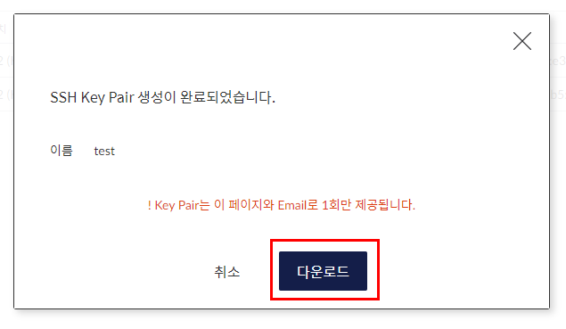
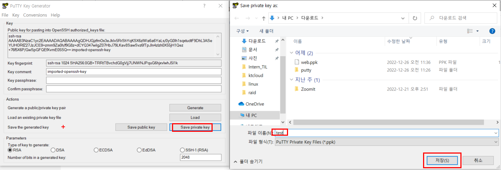
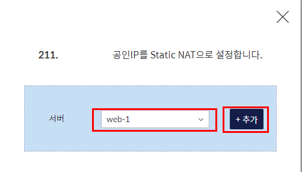
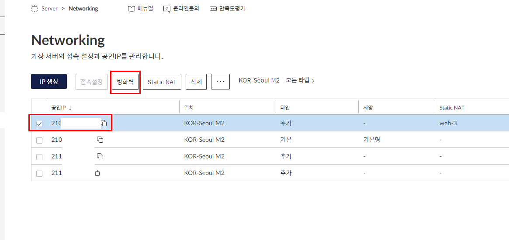
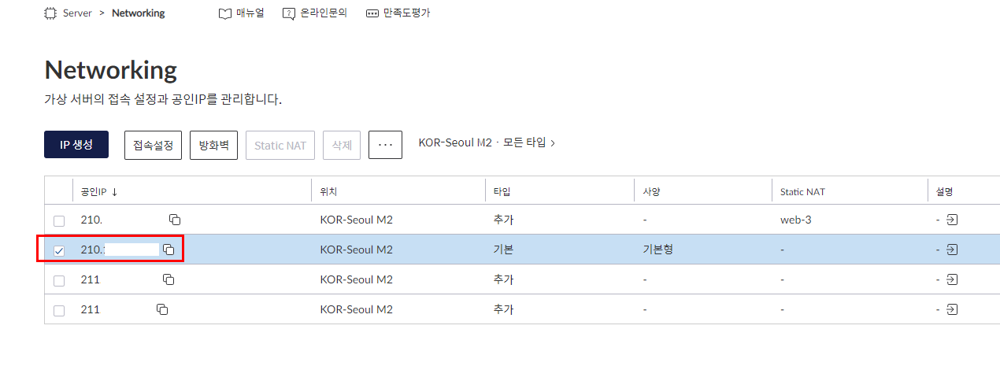
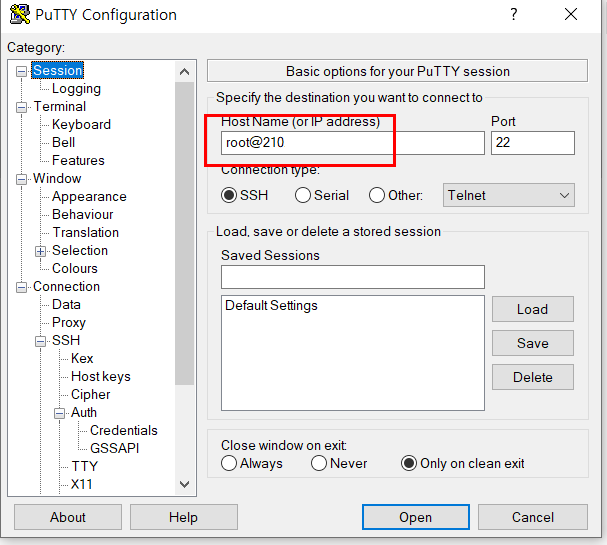
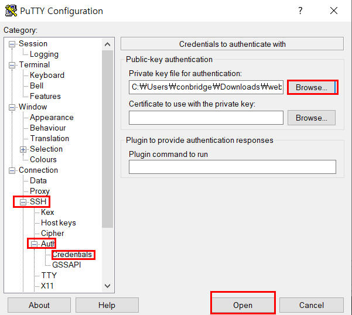

# KTcloud
## Server
### Server 생성하기
 
 
서버 이름, 사양, 요금제를 선택한 다음 생성을 한다. 

### Network 생성하기
만약 KTcloud가 처음이라 server을 최초로 생성을 했으면 자동으로 네트워크가 하나 만들어진다. 추가로 만들고 싶으면 `IP생성`을 눌러준다. 
 
 

### SSH Key Pair
 
 
위치를 server와 잘 맞춰 생성해주고 .PEM 파일을 잘 보관해둔다. 
 
 
 
`Putty`를 다운받으면 나오는 `PUTTYGEN`파일로 key파일을 PEM에서 PPK로 변경한다. 

### Network Server에 연결하기
네트워크에 사설IP를 가진 서버와 연결하여 외부와 통신을 할 수 있게 만들어 준다. 방법은 두 가지로, `접속설정`을 이용해 포트로 통신하는 방법이고, 다른 하나는 `Static NAT`를 이용해 연결하는 방식이다.
- 접속설정
     
    내가 만들어둔 server를 선택하고 포트를 남겨주면 된다. 22은 SSH의 포트번호로 Putty를 이용해 원격으로 서버를 조종 할 수 있게 만들어준다.

- Static NAT
     
     
     
     
    연결이 끝나면 방화벽에서 포트를 열어준다. 퍼블릭 환경이기 때문에 모든 ip를 열어둔다. 

### Server에 원격 접속하기
 
 
server를 정지 후 상세 정보에서 SSH Key를 추가해준다음 실행해준다. 
 
 
 
 
- 네트워크로 가서 연결된 네트워크의 ip를 저장한다.
- putty에 `root@네트워크ip`를 입력해준다.
- ppk파일을 선택한 다음 `open`을 누르면 KT cloud에서 생성한 server의 콘솔에 원격으로 접속할 수 있다.

