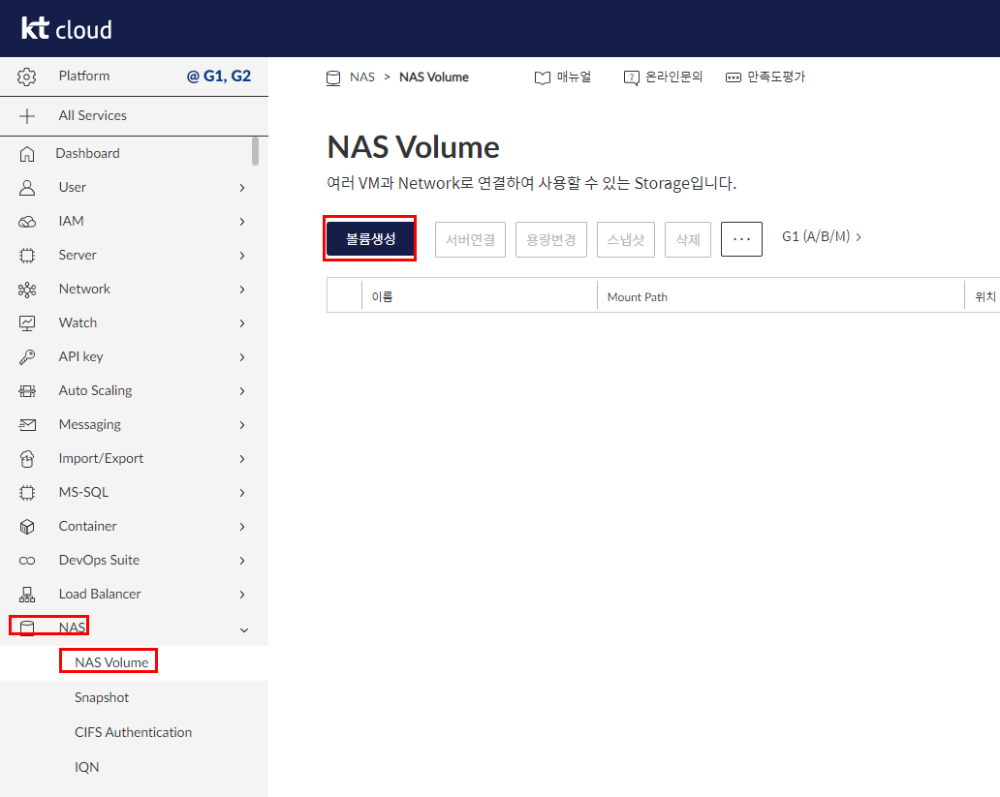
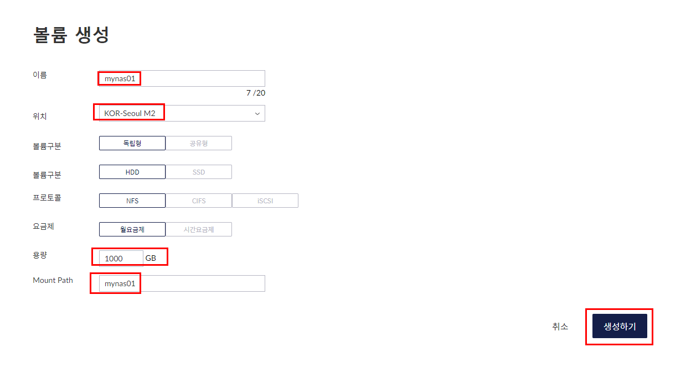
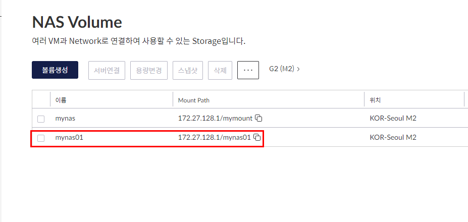
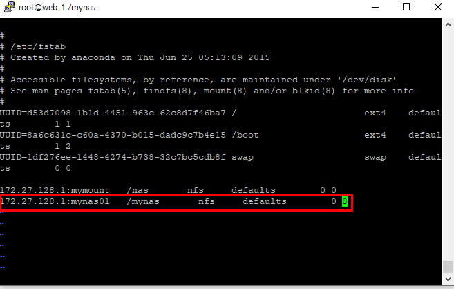
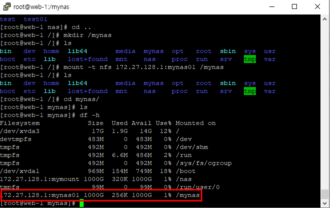
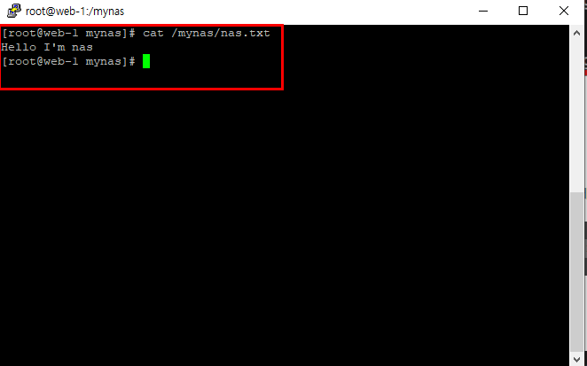
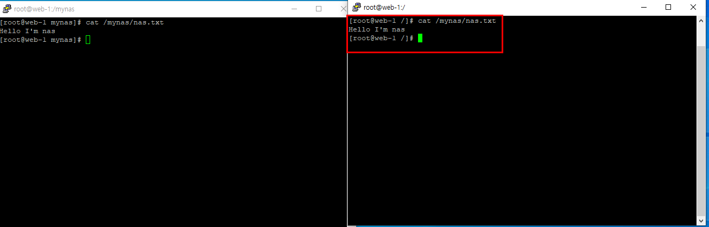

# NAS
## NAS 생성하기
<br/>
<br/>
<br/>

## NAS Server 만들기
```shell
# 필요한 패키지 다운
yum install -y showmount
yum install -y nfs-utils

# nas server에 연동할 디렉토리 생성
mkdir /mynas

# nas mount 하기
mount -t nfs 172.27.128.1:mynas01 /mynas    # nas의 ip:mount path

# nas server 등록하기
vi /etc/fstab
# 추가
172.27.128.1:mynas01   /mynas       nfs     defaults        0 0
```
<br/>
### 연결 확인
```
df -h
```
<br/>

## NAS Server에 연결하기
client server 준비<br/>
```shell
yum install -y showmount
yum install -y nfs-utils
mkdir /mynas
mount -t nfs 172.27.128.1:mynas01 /mynas
vi /etc/fstab
mount -t nfs 172.27.128.1:mynas01 /mynas
df -h # 연결 확인
```
## 2대의 server가 NAS server에 연결됐는지 확인
```shell
echo "Hello I'm nas" >> /mynas/nas.txt
cat /mynas/nas.txt
```
<br/>

- 다른 client server에서 확인
    <br/>


