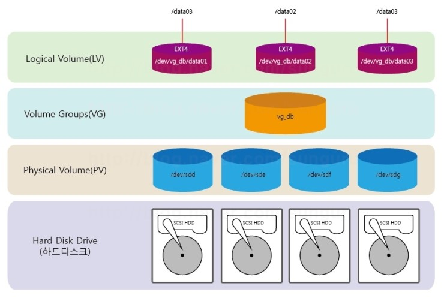
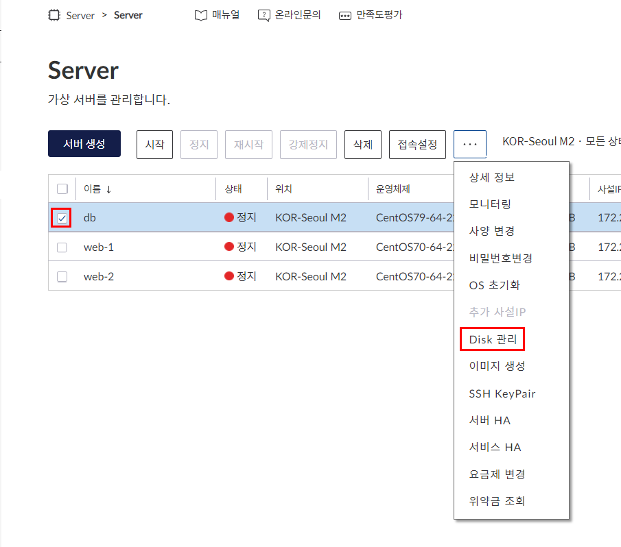
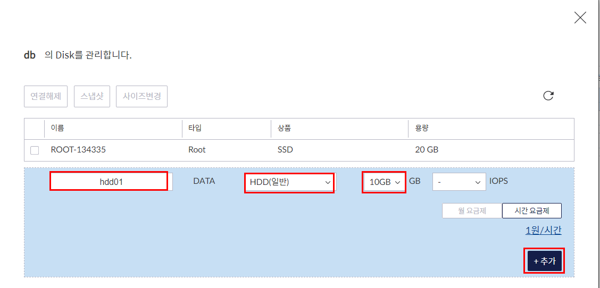
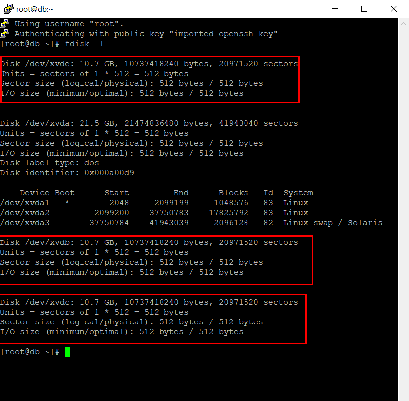
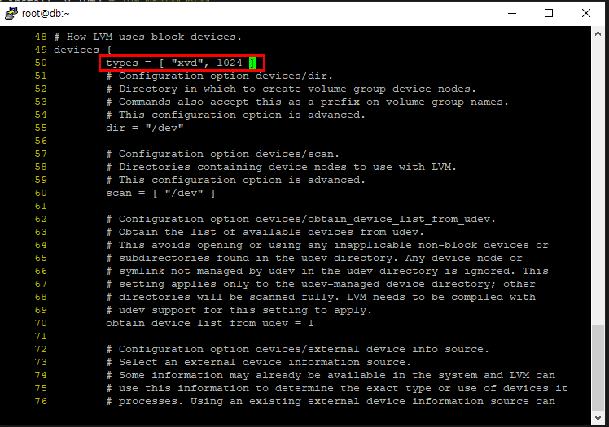
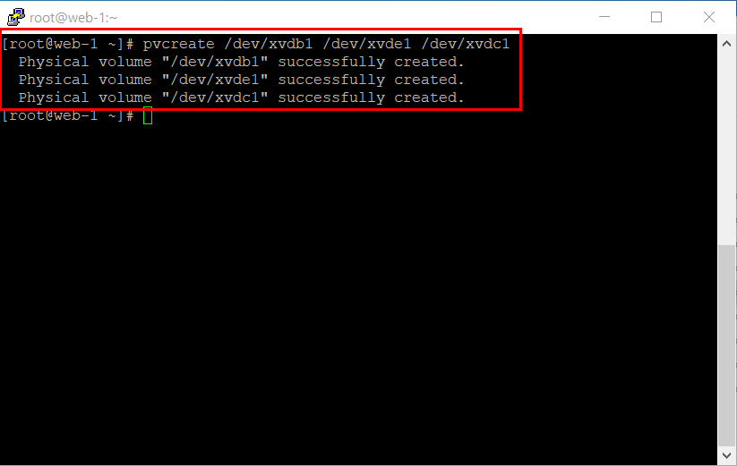
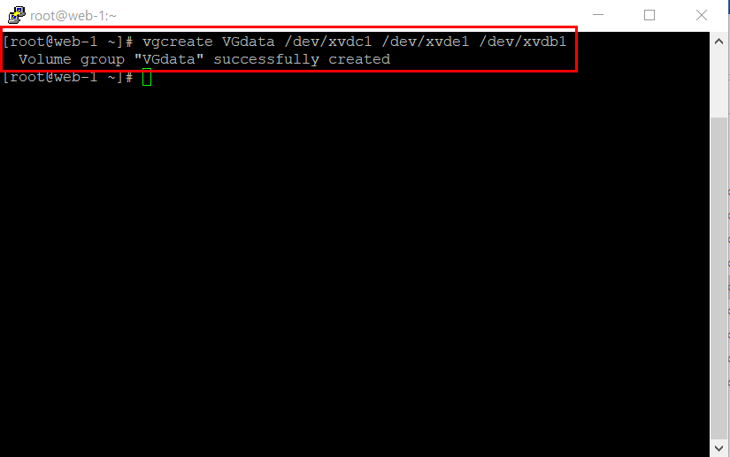
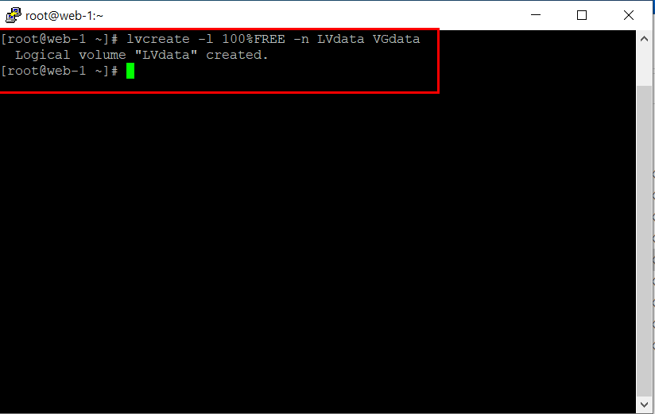

# LVM(Logical Volume Manager)
KTcloud의 가상환경에서 10GB HDD DISK를 3개 추가, LVM 후 `/data`에 mount하기<br/>

## LVM이란?
논리적인 볼륨을 관리하는 관리자 라는 뜻이다. 여러개의 물리적 디스크(대표적으로 SSD,HDD)를 논리적 디스크로 할당하여 유연하게 관리할 수 있게 해준다.<br/>

## 전체적인 구상도
<br/>
물리적인 디스크를 장착하고 LV까지 하려면 `PV-VG-LV` 순서로 진행된다.<br/>

## 물리적 디스크 장착
- KTcloud에서 server 생성 후 `정지`를 누르고 `Disk관리`에 들어간다.<br/>
<br/>
- `이 서버에 Disk추가`클릭
<br/>
- 이름과 사양을 입력 후 디스크를 서버에 추가해준다. 이번실습에는 10GB 3개를 설치할 예정이다.<br/>
<br/>

## 파티션 나누기
설치된 HDD를 바로 쓸 수 있는게 아니다. 콘솔에 접속해 설치된 HDD에 파티션들을 설정해야 한다.<br/>
- HDD 설치 확인<br/>
    ```shell
    fdisk -l
    ```
    <br/>
- 파티션 추가<br/>
    ```shell
    fdisk /dev/xvde # xvdb, xvdc도 해준다.
    n   
    e
    1
    enter
    enter
    w
    ```
    <br/>

- 확인<br/>
    ```shell
    lsblk   # 파티션 확인
    ```
    <br/>

## PV(Physical Volume)
PV(Physical Volume)는 LVM 용도로 초기화 된 파티션 또는 하드디스크를 뜻한다.<br/>
### PV생성
```shell
yum install -y lvm2 # lvm 패키지 설치
vi /etc/lvm/lvm.conf # conf파일 설정
```
```shell
devices {
         types = [ "xvd", 1024 ]    # 추가
}
```
<br/>

```shell
pvcreate /dev/xvdb /dev/xvde /dev/xvdc  # pv생성
```
<br/>

## VG(Volume Group)
PV들의 집합으로 LV를 할당할 수 있는 공간이다.

### VG생성
```shell
vgcreate VGdata /dev/xvdc /dev/xvde /dev/xvdb   # vgcreate "VG 이름" "생성할 PV 이름"
```
<br/>

## LV(Logical Volume)
VG에서 논리적으로 Volum을 지정하여 만든 파티션이다.

### LV생성
```shell
lvcreate -l 100%FREE -n LVdata VGdata   # LVdata라는 이름과 VG 100%용량으로 LV를 생성한다.
mkfs.ext4 /dev/VGdata/LVdata    # 만든 LV 포맷
```
<br/>

### LV 마운트
```shell
mkdir /data
mount /dev/VGdata/LVdata /data
df -h
```
3개의 HDD가 하나로 변해 30GB의 LV가 됐고 `/data`에 마운트 된것을 확인할 수 있다.<br/>
<br/>