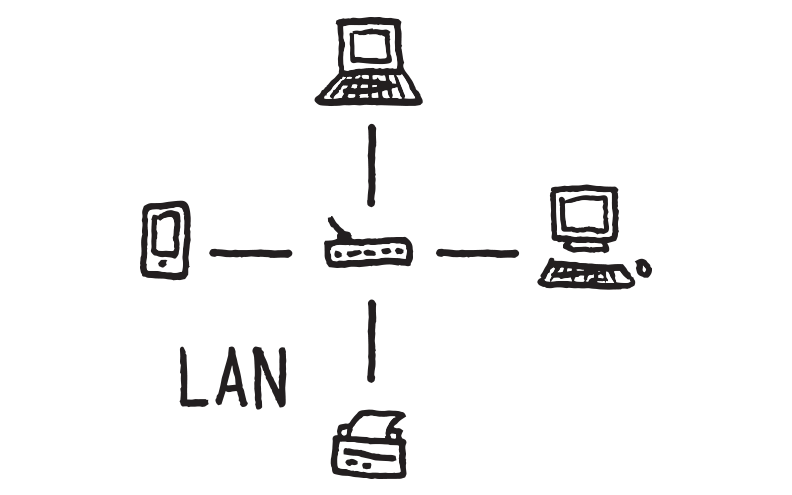
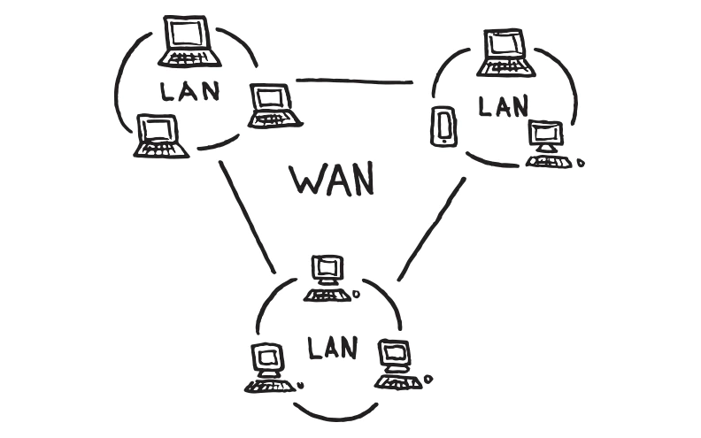
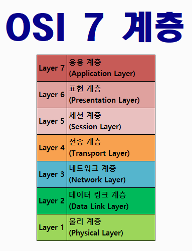
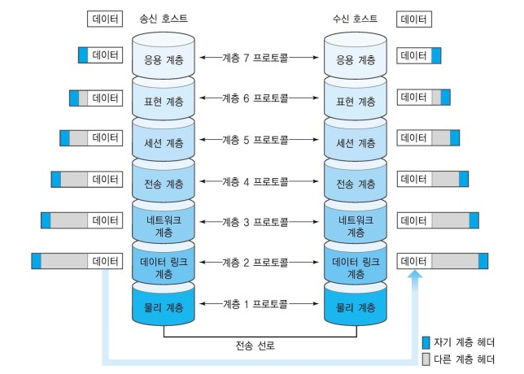

# Network
## 네트워크란?
 
네트워크란 전자신호를 통해 통신하는 모든 기기가 서로 통신하기 위해 만든 하나의 망을 의미한다.​ 

## 네트워크의 규모
### 근거리 통신망(LAN)​
 
- 건물 안, 혹은 특정 지역을 범위로 하는 네트워크​ 
- 범위가 좁고 연결하는 거리가 짧은 만큼 신호가 약해지거나 오류가 발생할 확률이 낮다. 

### 광역 통신망(WAN)​
 
- 지리적으로 넓은 범위에 구축된 네트워크​
- 멀리 떨어져 있는 LAN과 연결되야 하기 때문에 신호가 약해지거나 오류가 발생할 확률이 상대적으로 높다.​ 

## 네트워크 모델
### OSI 7 Layer
 
OSI 7 Layer는 국제표준화 기구(ISO)에서 개발한 모델로, 컴퓨터 네트워크 프로토콜 디자인과 통신을 계층으로 나누어 설명한 것이다. 

데이터는 다음과 같은 과정을 거처 상대방에게 데이터를 전송한다. 
 

#### 7계층(응용 계층)
응용 계층은 사용자 또는 어플리케이션이 네트워크에 접속할 수 있게 해준다. 
- 단위 : Message 또는 Data
- 대표 장치 : L7 Switch, 방화벽
- 프로토콜 : FTP, HTTP, HTTPS, XML, Telnet, SSH, SMTP, POP3, IMAP 등 
포트 번호를 통해 L4~L5와 통신한다.

#### 6계층(표현 계층)
표현 계층은 응용계층으로 전달, 전송하는 데이터의 인코딩 및 디코딩이 이루어지는 계층이다. 
- 프로토콜 : ASCII, 유니코드, MIME, EBCDIC, UTF-8, MBCS. EUC-KR, JPG, MP3, MPEG 등

#### 5계층(세션 계층)
세션 계층은 양 끝단의 응용 프로세스가 통신을 관리하기 위한 방법을 제공한다. 이 계층은 TCP/IP 세션을 만들고 없애는 작업을 한다. 
- 대표 장치 : L4 Switch 
- 프로토콜 : TCP, UDP

#### 4계층(전송 계층)
전송 계층은 데이터 전송에 관한 서비스를 제공하는 계층으로 송신 측과 수신 측 사이의 실제적인 연결 설정 및 유지, 오류 복구와 흐름 제어들을 통해 신뢰성 있는 통신이 가능하도록 한다. 
- 단위 : Segment(세그먼트)
- 대표 장치 : L4 Switch
- 프로토콜 : TCP, UDP

#### 3계층(네트워크 계층)
네트워크 계층은 데이터 패킷 단위로 분할하여 전송하며 데이터 전송과 경로 선택에 관한 서비스를 제공한다. 
- 단위 : Packet(패킷)
- 대표 장치 : Router(라우터), L3 Switch
- 프로토콜 : IP, ARP/NDP, RIP, RIP v2, OSPF, IGRP, EIGRP, BGP 등등의 Routing Protocol, AS번호, NAT 등

#### 2계층(데이터링크 계층)
데이터링크 계층은 상위 계층인 네트워크 계층에서 받은 데이터 프레임이라는 논리적인 단위로 구성하고 필요한 정보를 덧붙여 물리 계층으로 전달한다.  

- 단위 - frame
- 대표 장치 - L2 Switch, 모뎀, 기지국, 인터넷 공유기, Wi-Fi 공유기
- 프로토콜 : CSMA/CD, CSMA/CA, Slott Aloha, DAC/ADC, Multiplexer, Demultiplexer, MAC주소 관리 등

#### 1계층(물리 계층)
물리 계층은 실제 장치들을 연결하기 위해 필요한 케이블 및 연결 장치 등과 같은 기계적인 항목과 전압, 신호 방식 등의 전기적인 항목에 대한 특성을 규정한다. 

- 단위 : bit
- 대표 장치 : 동축케이블, 안테나, Hub, 리피터
- 프로토콜 : 이더넷, USB 등 케이블 , Bluetooth, Wi-Fi, LTE, 5G 등 안테나

### TCP/IP
OSI 7계층이 네트워크 전송의 데이터 표준이라고 한다면, TCP/IP 4계층은 이를 실제로 사용하는 인터넷 표준이다.

이런식으로 주석을 달 수 있다.[1](#footnote_1)

<!-- 글 뒷 부분에 -->
<a name="footnote_1">1</a>: 주석에 관한 설명을 이곳에...
