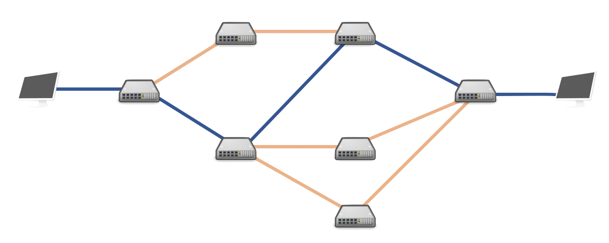
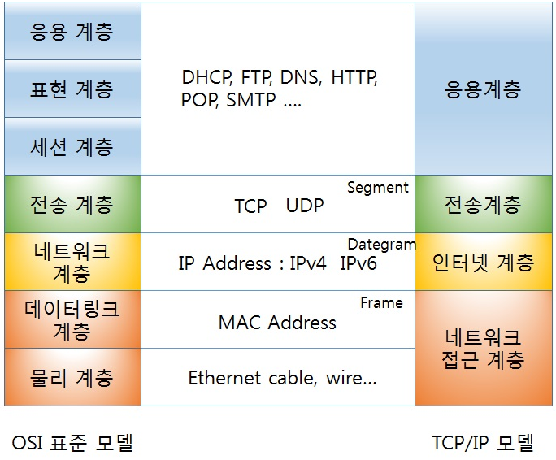
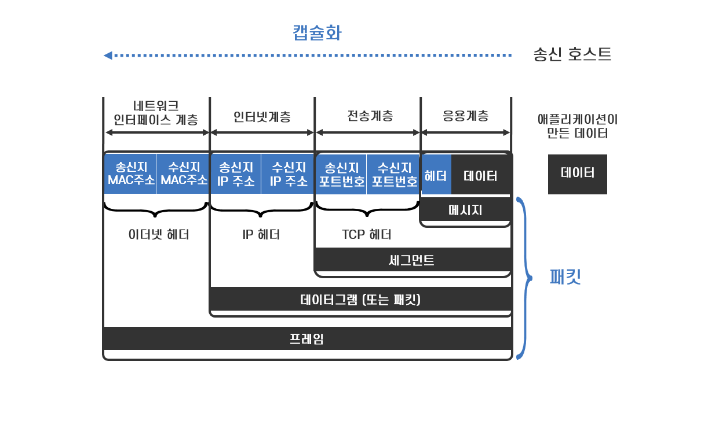

# Network
## 네트워크란?
 
네트워크란 전자신호를 통해 통신하는 모든 기기가 서로 통신하기 위해 만든 하나의 망을 의미한다.​ 

## 데이터 교환 방식
### 회선 교환 방식
 
발신자와 수신자 또는 통신 쌍방이 통신을 시작하기 전에 미리 전용 연결(회선 또는 채널)을 설정해야만 하는 네트워크를 말한다. 통신하는 동안에는 해당 연결이 독점적으로 발신자 및 수신자에 의해서만 사용된다. 통신이 끝났을 때는 반드시 연결을 해제하는 절차가 필요하다.

초기 전화 시스템이 대표적인 예이다. 전화 가입자는 전화 통화를 위해 교환수에게 이야기하고 싶은 상대방 정보를 말하고, 교환수는 통신 연결을 위한 작업을 수행한 후에야 비로소 전화 가입자 간의 통신이 이루어진다. 이 때, 교환수가 하는 작업은 물리적으로 전화선을 쌍방간에 연결하여 설정하는 작업이다. 이 때, 해당 연결 설정이 해제되지 않는 이상 다른 사람이 현재 통화중인 사람과 통화할 수는 없다. 설사 통화중인 사람이 서로 아무런 이야기를 주고 받지 않더라도 마찬가지이다.

그 후에 다중 통신 연결을 다중화하는 것이 가능해졌다. 하지만, 다중화된 링크 속의 각각의 채널은 같은 시간에 하나의 통신에만 사용된다.

이러한 회선 교환 방식은 (일시적이든 아니든) 실제 사용하지 않더라도 연결이 설정되면, 해당 연결에 소모되는 망자원, 정확하게는 중계노드들의 대역폭을 낭비하게 되므로 비효율적이다.

### 패킷 통신
 
작은 블록의 패킷으로 데이터를 전송하며 데이터를 전송하는 동안만 네트워크 자원을 사용하도록 하는 방법을 말한다. 정보 전달의 단위인 패킷은 여러 통신 지점(Node)을 연결하는 데이터 연결 상의 모든 노드들 사이에 개별적으로 경로가 제어된다. 이 방식은 통신 기간 동안 독점적인 사용을 위해 두 통신 노드 사이를 연결하는 회선 교환 방식과는 달리 짤막한 데이터 트래픽에 적합하다.

## 네트워크의 규모
### 근거리 통신망(LAN)​
 
- 건물 안, 혹은 특정 지역을 범위로 하는 네트워크​ 
- 범위가 좁고 연결하는 거리가 짧은 만큼 신호가 약해지거나 오류가 발생할 확률이 낮다. 

### 광역 통신망(WAN)​
 
- 지리적으로 넓은 범위에 구축된 네트워크​
- 멀리 떨어져 있는 LAN과 연결되야 하기 때문에 신호가 약해지거나 오류가 발생할 확률이 상대적으로 높다.​ 

## 네트워크 모델
### OSI 7 Layer
OSI 7 Layer는 국제표준화 기구(ISO)에서 개발한 모델로, 컴퓨터 네트워크 프로토콜 디자인과 통신을 계층으로 나누어 설명한 것이다. 

데이터는 다음과 같은 과정을 거처 상대방에게 데이터를 전송한다. 
 

#### 7계층(응용 계층)
응용 계층은 사용자 또는 어플리케이션이 네트워크에 접속할 수 있게 해준다. 
- 단위 : Message 또는 Data
- 대표 장치 : L7 Switch, 방화벽
- 프로토콜 : FTP, HTTP, HTTPS, XML, Telnet, SSH, SMTP, POP3, IMAP 등 
포트 번호를 통해 L4~L5와 통신한다.

#### 6계층(표현 계층)
표현 계층은 응용계층으로 전달, 전송하는 데이터의 인코딩 및 디코딩이 이루어지는 계층이다. 
- 프로토콜 : ASCII, 유니코드, MIME, EBCDIC, UTF-8, MBCS. EUC-KR, JPG, MP3, MPEG 등

#### 5계층(세션 계층)
세션 계층은 양 끝단의 응용 프로세스가 통신을 관리하기 위한 방법을 제공한다. 이 계층은 TCP/IP 세션을 만들고 없애는 작업을 한다. 
- 대표 장치 : L4 Switch 
- 프로토콜 : TCP, UDP

#### 4계층(전송 계층)
전송 계층은 데이터 전송에 관한 서비스를 제공하는 계층으로 송신 측과 수신 측 사이의 실제적인 연결 설정 및 유지, 오류 복구와 흐름 제어들을 통해 신뢰성 있는 통신이 가능하도록 한다. 
- 단위 : Segment(세그먼트)
- 대표 장치 : L4 Switch
- 프로토콜 : TCP, UDP

#### 3계층(네트워크 계층)
네트워크 계층은 데이터 패킷 단위로 분할하여 전송하며 데이터 전송과 경로 선택에 관한 서비스를 제공한다. 
- 단위 : Packet(패킷)
- 대표 장치 : Router(라우터), L3 Switch
- 프로토콜 : IP, ARP/NDP, RIP, RIP v2, OSPF, IGRP, EIGRP, BGP 등등의 Routing Protocol, AS번호, NAT 등

#### 2계층(데이터링크 계층)
데이터링크 계층은 상위 계층인 네트워크 계층에서 받은 데이터 프레임이라는 논리적인 단위로 구성하고 필요한 정보를 덧붙여 물리 계층으로 전달한다.  

- 단위 - frame
- 대표 장치 - L2 Switch, 모뎀, 기지국, 인터넷 공유기, Wi-Fi 공유기
- 프로토콜 : CSMA/CD, CSMA/CA, Slott Aloha, DAC/ADC, Multiplexer, Demultiplexer, MAC주소 관리 등

#### 1계층(물리 계층)
물리 계층은 실제 장치들을 연결하기 위해 필요한 케이블 및 연결 장치 등과 같은 기계적인 항목과 전압, 신호 방식 등의 전기적인 항목에 대한 특성을 규정한다. 

- 단위 : bit
- 대표 장치 : 동축케이블, 안테나, Hub, 리피터
- 프로토콜 : 이더넷, USB 등 케이블 , Bluetooth, Wi-Fi, LTE, 5G 등 안테나

### TCP/IP
OSI 7계층이 네트워크 전송의 데이터 표준이라고 한다면, TCP/IP 4계층은 이를 실제로 사용하는 인터넷 표준이다. 

 

#### 송신 호스트 입장에서
 
1. 응용 계층은 TCP/IP 를 사용하는 애플리케이션이 사용하는 프로토콜에 필요한 정보를 헤더로 담는다. 예를 들어 HTTP 통신이면 HTTP 헤더를 붙인다.
2. 전송 계층은 해당 패킷의 송신지, 수신지 각각의 포트번호 정보를 담게 되어 수신 호스트에 도착했을 때 어떤 소켓에 데이터를 갖다줄 지에 대한 정보를 담게 된다.
3. 인터넷 계층은 해당 패킷의 송신지, 수신지 각각의 IP 주소 정보를 담게 되어 네트워크의 모든 라우터들이 이를 참조하여 가장 효율적인 경로로 패킷을 라우팅해주게 된다.
4. 네트워크 인터페이스 계층은 비교적 물리적인 정보를 담게 된다. 송신지 및 수신지의 MAC 주소를 담아 이더넷 카드를 통해 해당 패킷을 내보낸다.

#### 수신 호스트 입장에서
1. 수신 호스트의 네트워크 인터페이스 계층에 패킷이 도착하게 되면, 이를 인터넷 계층으로 올려보낸다.
2. 인터넷 계층은 해당 패킷의 IP 헤더를 뜯어봤을 때 발신지를 확인하고, 수신지가 자기 자신이라면 해당 패킷을 전송 계층으로 올려보낸다.
3. 전송 계층은 해당 패킷의 TCP 헤더를 뜯어봤을 때 발신 및 수신 포트번호를 확인하여 응용 계층으로 패킷을 올려보낸다. 모든 패킷이 도착했다면, 순서를 정렬하여 원래 데이터 형태로 정립하여 수신 포트번호에 해당하는 프로세스에 보낸다.
4. 응용 계층은 해당 패킷의 애플리케이션 헤더를 뜯어보고, 도착한 데이터를 통해 적절한 조치를 취한다. HTTP 통신이라면 웹페이지를 읽어들이는 작업을 할 것이다.

